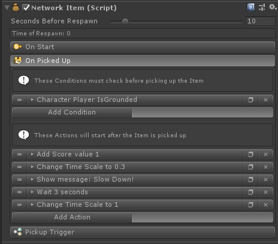

# Network Items

**Network items** are pickup-able objects that are allowed to re-spawn after someone pick it up. These items re-spawn on the same place it was before.

If you don't want an item to re-spawn, set **Seconds Before Respawn** to 0.

This component it's extended from Game Creator's trigger so you are able to select how do you want this item to be picked up.


Network item **actions** are only executed for the **Local Player**



A re-spawning item should stick to a fixed position. It should not be observed at all (in any **PhotonView**). It can only be consumed and can't be dropped somewhere else (cause that would double the item)

