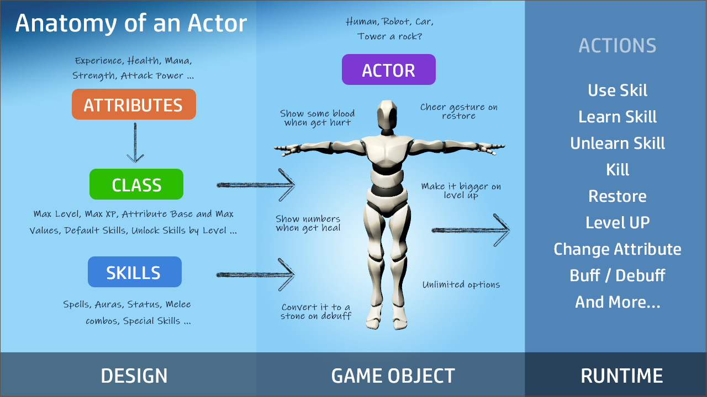
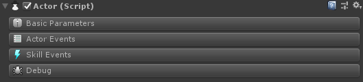

# Actor

The heart of the **RPG** module is composed by 1 single component called **Actor**, this is the only component you need to setup. In theory the actor component is a processor for Actor Class and Attributes and trigger of multiple events. This component can be attached to any gameobject.


&#x20;Want to have a box that gets destroyed after 5 hits and explode into pieces when it's destroyed? You can add an Actor component and get it working in few clicks.


## Actor Component

In the actor component is divided in 4 sections:

* [**Basic Parameters**](./#basic-parameters)**:** basic parameters and definition for the Actor
* [**Actor Events**](./#actor-events): here you can set execute actions for multiple actor events
* [**Skill Events**](./#skill-events): you can react based on multiple skill events
* [**Debug**](./#debug): easily see what's going with. &#x20;

## Basic Parameters

In here we can setup our Actor basic settings like name and description, class, initial level

.PNG>)

* **Definition:** the first part of the inspector allows you to define a name, description, sprite and color all of this useful for use on a character selection screen or any other UI related screen.\

* **Class:** setup class and initial level of the actor.  For example, set initial level to a higher value if you want for example make a character more difficult to kill.\

* **Misc**: by setting an actor as **invulnerable** this means it cannot take damage or get killed. You can also setup the status towards the player _**Hostile**_, _**Neutral**_ or _**Friendly**._ \

* **Death:** if **auto detect death** is off the **Death Event** won't be called automatically you can use the Kill Action to do it manually.


Do you need to make an **Actor** more **difficult**? Just set the initial level to a higher value this could increase all Attributes if the class is properly setup.


## Actor Events

With actor events you have 5 different type of events to execute actions:

* **Ready**: these actions are executed after Actor Class has been setup, think of it like a start event but after actor component its fully initialized.\

* **Death**: on this event is executed when Actor dies (ran out of HP). This is the place to play a death animation. It's also possible to use conditions to check who killed this actor and for example end the game if was killed by a boss.\

* **Restore**: these actions are executed if the Actor is Restored/Resurrected manually using the Restore Action. For example: you can easily setup a skill that can resurrect an actor or simply use the Death event wait couples and restore it.\

* **Level:** this event allows you to execute actions when Actor level changes. For example, if you want to instantiate a particle effect when the actor levels up you can use Actor Level Changed condition with 'went up' option turn on.


If **Auto Detect Death** is off in Actor's basic parameters **Death Event** won't be executed automatically. You can manually execute by triggering the Kill Action for the actor.&#x20;


## Skill Events

Under skill events there is 6 events to customize your actor:

* **Used**: as the name suggests this event  is called when a skill is executed. It's possible to use conditions to react based on the skill that's being executed.\

* **Cannot Use**: when a skill doesn't met conditions this event is executed. For example, if a skill has a condition of "mana greater than 5" and the actor have less 'mana' the event it's going to be executed. \

* **Learn**: event executed when the actor learns a new Skill. As all other events there is a condition to know which skill was learned.\

* **Unlearn**: event executed when actor unlearns a Skill.\

* **Canceled**: this event is called when a Skill is canceled by Skill Cancel Action. For example, a parry Skill could cancel a skill and stun an actor.\

* **Ended**:  event executed when actor ends using a Skill.

## Debug

Debug tab provides multiple ways to test and debug your Actor. You can **Kill**, **Restore**, **Damage**, **Heal**, **Add Experience**, **Level Up**, **Execute Skills** as many times as you like. Also preview all **attribute** values.

## Save & Load System

Actor's are compatible with the [Save & Load](https://docs.gamecreator.io/game-creator/tools/game-creator-api/custom-save-and-load) system from Game Creator. You don't have to do anything to make this work.

