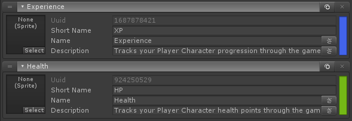
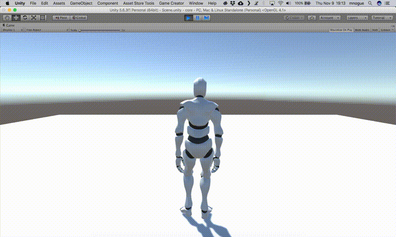

# Attributes

## Definition

Attributes are basically simple data holders they contain just simple basic definition.

* **Sprite**: this is used by the UI components like **Skill Bar** or **Spell Book**
* **Short Name**: for now this is only used by formulas
* **Name**: the identifier of the skill
* **Description**: this is used by UI tooltip if its enabled.
* **Color**: color also can be used UI components like the **Character HUD**

## Concepts

At run-time by using [**actions** ](https://njg.gitbook.io/gc-modules/\~/drafts/-LGYBUg5rvA5jswJTE97/primary/rpg/rpg/attributes/actions#action-change-attribute)and [**conditions**](https://njg.gitbook.io/gc-modules/\~/drafts/-LGYH0XyV61gHyNFfDkv/primary/rpg/rpg/attributes/conditions#condition-attribute-compare) you have access to multiple values from an attribute:

* **Consumable Value**: this is the variable/consumable value of the attribute. Used to track the **current** value of an attribute like **Health** or **Mana**. This is not used with attributes that do not get consumed, like **Strength** or **Intelligence**.\

* **Value**: this is the real value of the attribute. This is the value to read when you want to see what **Strength**, **Intelligence**, etc is, or if you want to know what is the **max value** is that **Health** or **Mana** type attributes can reach. This value contains both **base value** + **bonus value**.\

* **Bonus**: this is as the name suggests the bonus value of an attribute.\

* **Last Time Modified**: this allows you to verify when was the last time an attribute was modified. For example, you can create health regeneration skill that can only be triggered if last time modified of the health was 5 seconds ago.\

* **Percent**: this allows you to check how much percentage of an attribute an actor has. For example, if health is below 30% change character state to the Hurt state.


Game Creator's [state system](https://docs.gamecreator.io/game-creator/components/characters/states)


## Create Attribute

To create an attribute simply go to the **Game Creator** preferences window select the **RPG** tab then head to the attributes section and click on '**Create Attribute**'.


The base and max values of an **Attribute** are defined by the **Class** along with other settings.

