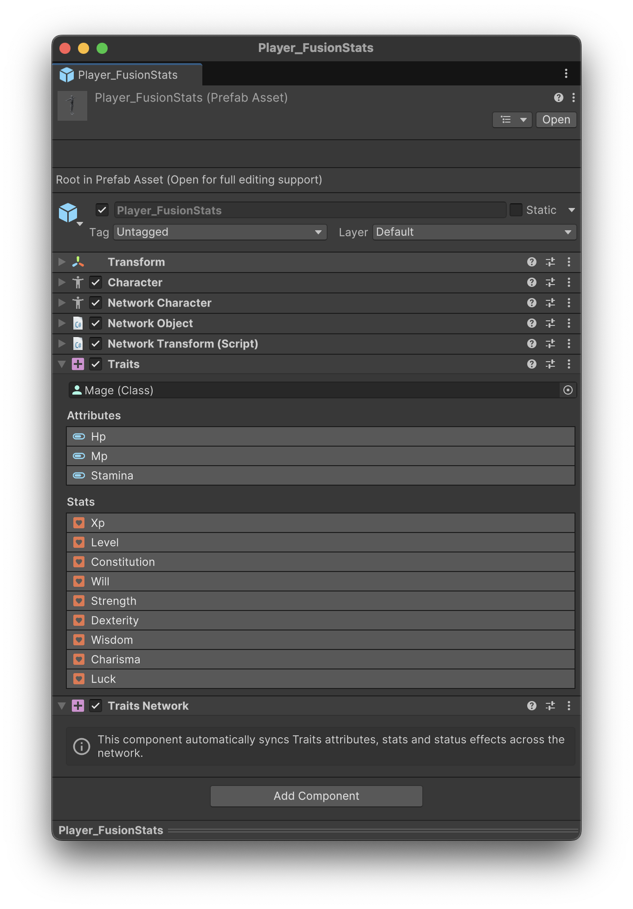

# User Interface

The **Factions** module comes with a collection of components designed to streamline the creation of UI windows and elements.

All examples that come with the module have been created with them and are flexible to accommodate any type of window.

## Factions List UI

This is one of the most important components and allows to display a list of **Factions** in a list fashion.

<figure><figcaption></figcaption></figure>

The **Member** field determines which component the factions are taken from.

The following fields act as filters to display those factions.

* The **Show** dropdown allows to display only factions that are in a particular state. For example, display only those that the Member is in or not.
* The **Show Hidden** toggle determines whether hidden factions should be displayed or not.
* The **Filter** dropdown allows to define whether to only display those factions that are present in a Global or Local List Variable.&#x20;

The **Content** field defines the `Rect Transform` where each prefab instance will be instantiated, for every visible faction.


The **Content** value should contain an auto-layout component, such as `Vertical Layout Group`, `Horizontal Layout Group` or `Grid Layout Group`.


The **Prefab** is the prefab instantiated inside the _Content_. It must contain a **Faction UI** component, which is automatically configured by its parent.

## Faction UI

This component is used in tandem with the **Factions List UI** to display a list of quests based on a set of rules and filters.
