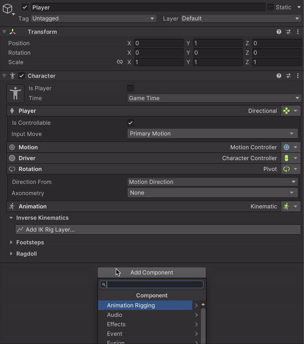

# Characters

## Overview

The **Network Character** is the component resposible for synchronizing player's movement, rotation, jump, attachments, ragdoll state, model change, look tracking and more.


This works with any type of controller like Navmesh, Tank, Rigidbody etc.


***

## Setup

Setting up a Game Creator character for Fusion is simple. Just attach a **`Network Character`** component, and it will automatically add all the necessary components, making it ready to use.

<figure><figcaption></figcaption></figure>

***

## Attachments

To synchronize attachments the objecs needs to be registered first, you can do this by using **Local List Variables Network** or **Gloal List Variables Network** and select the Attachments sync mode.

<figure><figcaption></figcaption></figure>

Once attachmets are registered you can use regular GC2 instructions to attach or remove objects

<figure><figcaption></figcaption></figure>

***

## Models

Models work the same way attachment does using **Local List Variables Network** or **Gloal List Variables Network** and select the **Models** sync mode

<figure><figcaption></figcaption></figure>

Once models are registered you can use regular Change Model instructio from GC2.

<figure><figcaption></figcaption></figure>

### Model Config

Models comes with a special variable type to use.


Values like **Name, Prefab** and **Sprite** can be used to display a list of characters&#x20;


<figure><figcaption></figcaption></figure>

### Properties

The fusion module includes properties for this new Model Config variable type like:

* **Model Prefab** (Game Object)
* **Model Name** (String)
* **Model Prefab Name** (String)
* **Selected Model** (String)
* **Model Sprite** (Sprite)
* **Selected Model Sprite** (Sprite)
