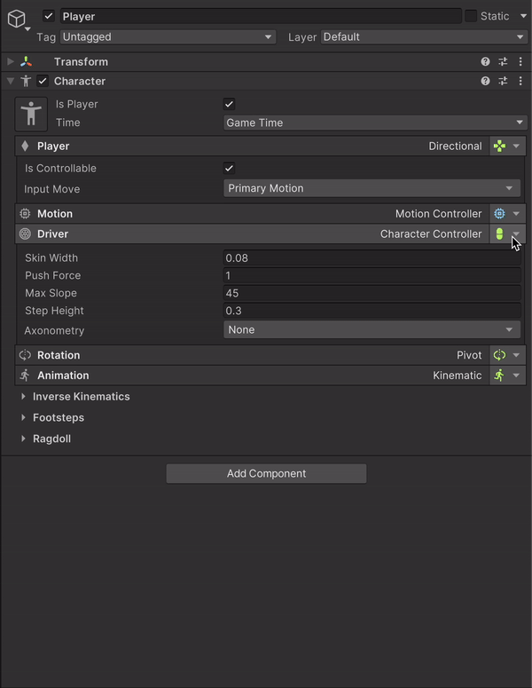

# Characters

Setting up a Game Creator charace for Fusion is very easy, all you need to do is change your player drive to **Fusion Driver Controller** this will automatically add all require components making ready to use.

<figure><figcaption></figcaption></figure>
