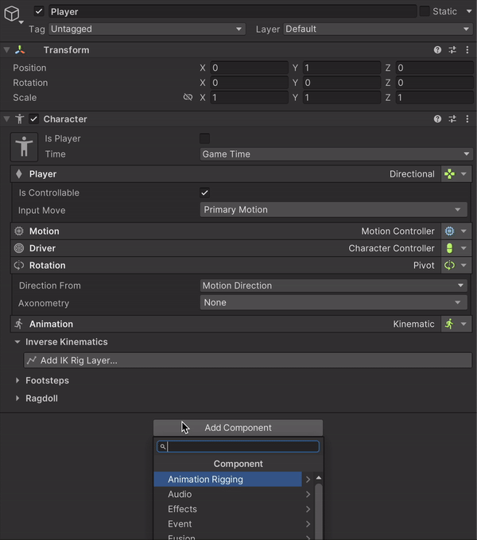

# Characters

## Overview

The **Network Character** component is the core synchronization system for Game Creator 2 characters in multiplayer. It handles movement, rotation, animations, attachments, models, and character state across all connected clients.


NetworkCharacter works with **any controller type**: NavMesh, Tank, Rigidbody, Point-and-Click, or custom controllers.


---

## In This Section

| Page | Description |
|------|-------------|
| [Attachments](attachments.md) | Synchronize weapons, gear, and cosmetics |
| [Models](models.md) | Synchronize character skins and models |
| [NPCs](npcs.md) | Non-player character synchronization |

---

## Setup

Adding multiplayer support to a Game Creator character is simple:

1. Select your character prefab
2. Add the **Network Character** component
3. Required components are automatically added

<figure><figcaption><p>Adding Network Character automatically configures networking</p></figcaption></figure>

### Auto-Added Components

| Component | Purpose |
|-----------|---------|
| **NetworkObject** | Fusion's core network identity |
| **NetworkTransform** | Position/rotation sync (if needed) |
| **NetworkMecanimAnimator** | Animation state sync |

---

## Synchronized State

NetworkCharacter automatically synchronizes the following data:

### Movement & Position

| Property | Description |
|----------|-------------|
| **Position** | World position of the character |
| **Rotation** | Character facing direction |
| **Move Direction** | Current movement input vector |
| **Input Direction** | Raw input direction |
| **Face Direction** | Look/aim direction |
| **Linear Speed** | Current movement speed |

### Character State

| Property | Description |
|----------|-------------|
| **Is Grounded** | Whether character is on ground |
| **Is Dead** | Death state |
| **Is Busy** | Busy state (performing action) |
| **Is Dashing** | Dash state |
| **Jump Count** | Current jump count |
| **Stand Level** | Crouch/stand level |

### Ragdoll State

| Property | Description |
|----------|-------------|
| **Ragdoll Position** | Position during ragdoll |
| **Ragdoll Rotation** | Rotation during ragdoll |
| **Is Ragdoll** | Ragdoll active state |


Combat-related state (blocking, defense, invincibility) is synchronized by the [Fusion Melee](../fusion-melee/) submodule.


---

## Inspector Options

### Network Character Settings

| Setting | Description |
|---------|-------------|
| **Sync Transform** | Enable position/rotation sync |
| **Sync Animator** | Enable animation sync |
| **Allow State Authority Override** | Allow ownership transfer |

### Runtime Inspector

At runtime, the inspector displays:

- Current network state values
- Authority information (Input/State)
- Connected player info
- Sync status indicators

---

## Authority System

NetworkCharacter respects Fusion's authority model:

### Input Authority
- The player who controls this character
- Can send input commands
- Set automatically when spawning player

### State Authority
- The peer responsible for this character's state
- Can modify networked properties
- Typically the host/server or the input authority

```
┌─────────────────────────────────────────────┐
│              Authority Flow                  │
├─────────────────────────────────────────────┤
│                                              │
│   Player Input                               │
│        │                                     │
│        ▼                                     │
│   ┌─────────────┐                           │
│   │   Input     │ ─── Has Input Authority    │
│   │  Authority  │                            │
│   └──────┬──────┘                           │
│          │                                   │
│          ▼                                   │
│   ┌─────────────┐                           │
│   │   State     │ ─── Has State Authority    │
│   │  Authority  │                            │
│   └──────┬──────┘                           │
│          │                                   │
│          ▼                                   │
│   Network Sync to All Clients                │
│                                              │
└─────────────────────────────────────────────┘
```


Always check authority before modifying networked state. Use the **Has State Authority** condition in your visual scripting.


---

## Visual Scripting Reference

### Conditions

| Condition | Description |
|-----------|-------------|
| **Is Local Player** | This is the local player's character |
| **Has Input Authority** | Has input authority over object |
| **Has State Authority** | Has state authority over object |
| **Is Proxy** | This is a remote representation |

### Properties

| Property | Type | Description |
|----------|------|-------------|
| **Network Character Is Moving** | Boolean | Movement state |
| **Network Character Is Dead** | Boolean | Death state |
| **Network Character Is Controllable** | Boolean | Can receive input |
| **Network Character Is Ragdoll** | Boolean | Ragdoll state |
| **Network Input Direction** | Vector3 | Current input vector |

### Events

| Event | Description |
|-------|-------------|
| **On Player Spawned** | Character spawned |
| **On Player Despawned** | Character despawned |
| **On State Authority Gained** | Gained control |
| **On State Authority Lost** | Lost control |

---

## Best Practices

### Performance

- Keep attachment lists small (only registered items sync)
- Use pooling for frequently spawned characters
- Minimize model variants loaded at once

### Authority

- Always check authority before state changes
- Use **Request State Authority** for dynamic ownership
- Handle authority lost/gained events for cleanup

### Synchronization

- Test with multiple clients to verify sync
- Use Debug mode to visualize network state
- Monitor console for sync warnings

---

## Troubleshooting

### Character not syncing

1. Verify NetworkObject is on the prefab
2. Check prefab is registered as network prefab
3. Ensure NetworkCharacter component is present

### Animations not syncing

1. Verify NetworkMecanimAnimator is attached
2. Check animator controller is the same on all clients
3. Ensure Animator parameters are marked for sync


See the [Troubleshooting Guide](../guides/troubleshooting.md) for more solutions.


---

## Related Documentation

- [Attachments](attachments.md) - Weapon and gear sync
- [Models](models.md) - Character skin sync
- [NPCs](npcs.md) - NPC synchronization
- [Variables](../variables.md) - Variable synchronization
- [Authority Guide](../guides/authority-system.md) - Understanding authority
