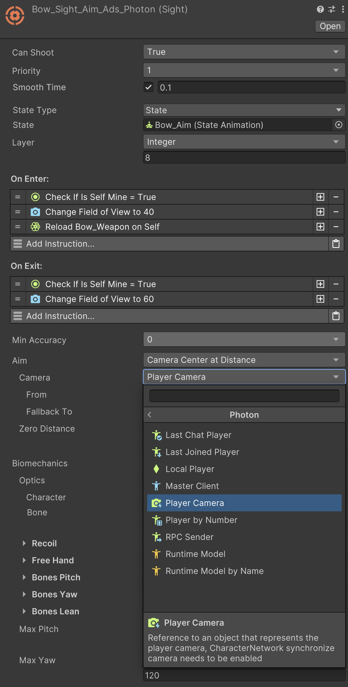

# 💫 Fusion Stats

Overview

The **Fusion Stats** submodule integrates Fusion 2 with the Stats 2 module, ensuring that all character traits data is synchronized across the network.

\
This includes:

* Stats
* Attributes
* Status Effects
* Modifiers


[**Get Fusion Stats on the Unity Asset Store →**](https://www.ninjutsugames.com/go/fusion-stats?src=docs_fusion_stats_overview)


## Requirements

Install [**Game Creator 2**](https://www.ninjutsugames.com/go/game-creator-2?src=docs_fusion_stats_requirement_gc2), [**Photon Fusion**](https://www.ninjutsugames.com/go/photon-fusion?src=docs_fusion_stats_requirement_sdk), [**Fusion**](https://www.ninjutsugames.com/go/fusion?src=docs_fusion_stats_requirement_core), and [**Stats 2**](https://www.ninjutsugames.com/go/stats-2?src=docs_fusion_stats_requirement_stats) before installing Fusion Stats.

## Setup

If you haven't get the **Fusion Stats** sub-module, head to the Asset Store product page and follow the steps to get a copy of this module.

Once you have bought it, click on **Window → Package Manager** to reveal a window with all your available assets.

Type in the little search field the name of this package and it will prompt you to download and install the latest stable version. Follow the steps and wait till Unity finishes compiling your project.


This package will add one new network component called **TraitsNetwork**


## Traits Network

Synchronizes traits stats, attributes, status effects, modifiers across the network.

<figure><figcaption></figcaption></figure>
